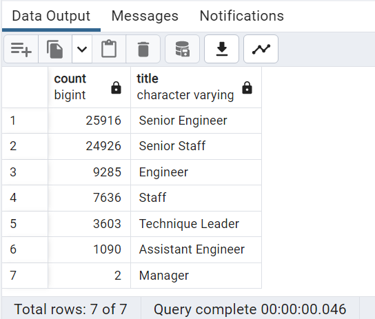
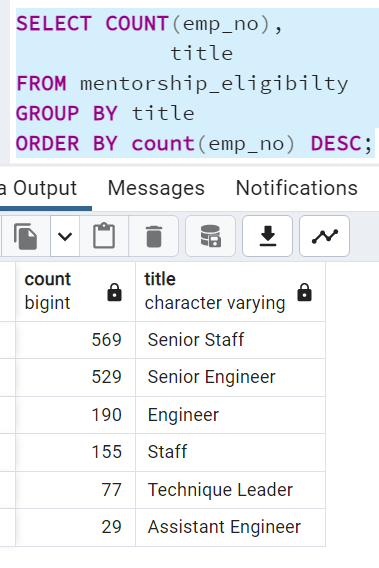

# Pewlett-Hackard-Analysis

## 1. Overview of the analysis:
Pewlett Hackard is a large Tech-company which has thousand of employees working. It is come to knowledge that baby boomers begin to retire at a rapid rate. Pewlett Hackard want to analyze the current situation on how many employees are going to retiere soon. PH want to offer,
1. Retirement package for those who meet certain criteria.
2. PH also need to start working on about which positions will need to be filled in the near future.

## 2. Results:
1. All the CSV data has been import to the PostgreSQL system for analysis.
2. Filtered the data and analyze how many employees are going to retiere soon.

    a. Total 72,458 employees are going to retiere soon.

    
    
    b. Most of the employees are retiering from Senior Engineer position as well as from Senior staff position.
3. Another set of data is also analyzed to see how many current employees are eligible to take mentorship.

     

    a. Senior Engineering: 25916 eng. employees going to retiere soon Vs. 529 employees may going to take mentorship which is 2.04%.
    b. Senior staff: 24926 senior staff are going to retiere soon Vs. 569 employees may going to take mentorship which is 2.28%.
    c. Over all: total 72,458 employees going to retiere soon Vs. total 1549 which is 2.13%.

## 3. Summary:  
    1. Total 72,458 rolls needs to be filled.
    2. Total 1,549 employees eligible to mentor the next generation.
    3. PH needs to start fill vacant position.
        a. needs to fill Senior Engineer and Senior Staff which has high gap.
    4. additional query run to find out total # of employees per title are eligible for mentor ship.

